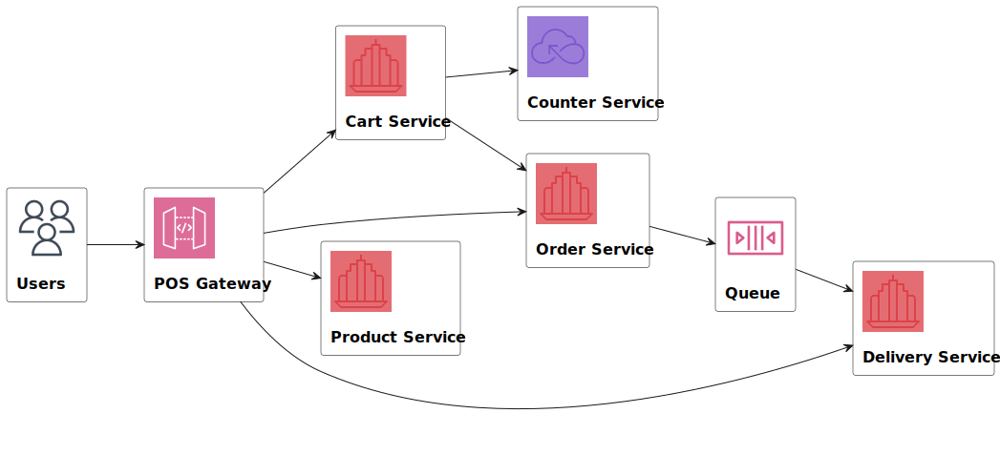
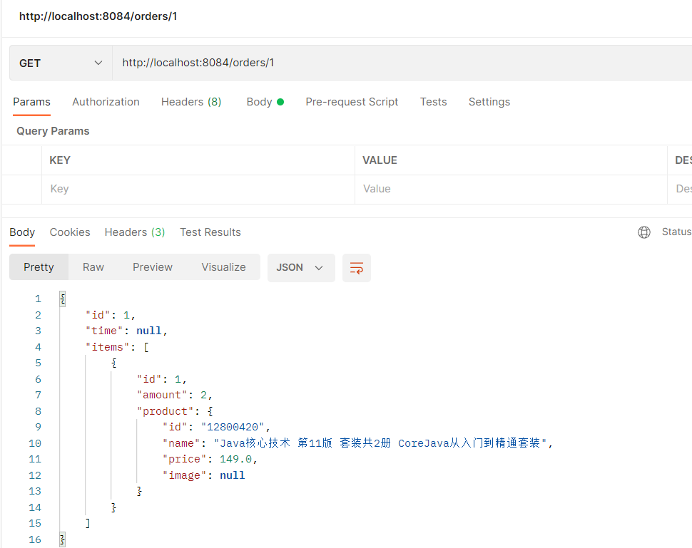

# aw07

Please extend your MicroPOS system by adding a delivery service shown as the following figure.

When an order is placed by a user, the order serivce sends out an event into some AMQP MOM (such as RabbitMQ). The delivery service will be notified and a new delivery entry will be generated automatically. User can query the delivery status for his orders.

Use [Spring Cloud Stream](https://spring.io/projects/spring-cloud-stream) to make the scenerio happen. Of coz you can refer to the [demo](https://github.com/sa-spring/stream-loan) for technical details.

### 1 修复了作业5中框架的部分bug

- 感谢id为“AldrichZeng”的学长在作业5报告中提到的关于`cartsRepository.save(cart)`会报错的bug，改用了本地存储购物车信息
  - 自己实现一个`CartRepositoryImpl`类继承老师提供的`CartRepository`接口，在该类中定义一个cart的List存放carts信息

尝试向id = 2的购物车中添加一个新的item（两次，观察到返回过来的body中amount = 2）：

Get /carts/2/total命令获取总价格为149 x 2 = 298：

### 2 添加pos-order模块

- 端口：8085
- order数据结构：
  - int id编号
  - string time 创建时间
  - List of items 订单中的商品
- 文件结构与carts类似，也是自己实现的`OrderRepositoryImpl`类在本地存order信息，避免.save()方法的报错
- api：
  - GET /orders: 获取所有的order信息
  - GET /orders/{orderId}: 获取id为orderId的order信息
  - POST /orders：创建一个新的order，id自动增加1
    - request body中是json格式的需要创建order的cartDto内容
    - 在处理的最后会将对应的cart删除
- 在pos-cart模块中新增`/carts/{cartId}/checkout`结账api，主要过程：
  - request body中是json格式的需要创建order的cartDto内容
  - 先根据cartId获取需要进行order服务的cart，然后将request body中的cartDto内容形成一个POST请求，发给pos-order模块，调用POST /orders的api进行服务

#### 2.1 测试pos-order模块

首先创建5个cart，id分别是0,1,2,3,4

然后向id为1的cart中添加item

最后调用POST carts/1/checkout，然后使用GET orders和GET orders/1查看结果：

有一个id为1的order，然后GET查找id为1的order：

然后GET carts查看所有的购物车，发现id为1的购物车已经被删除了：

